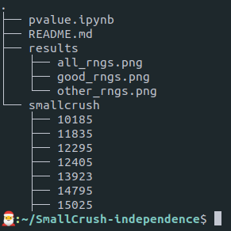
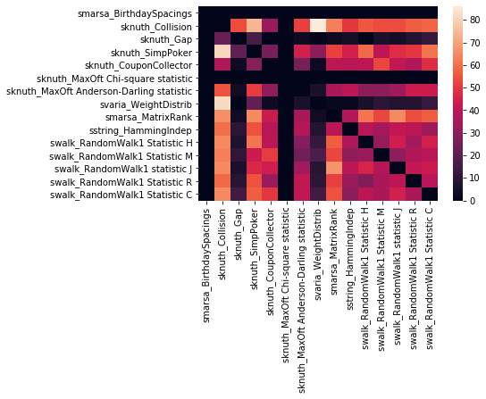
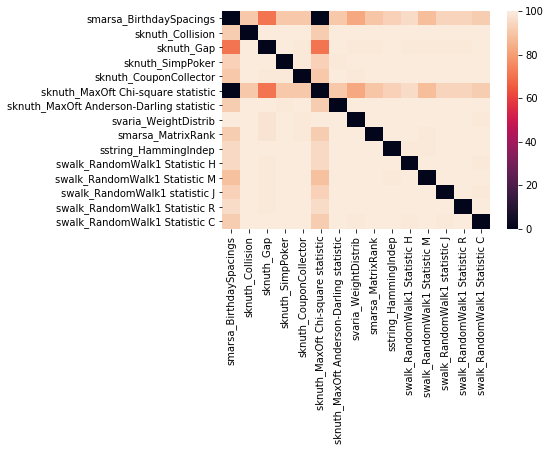
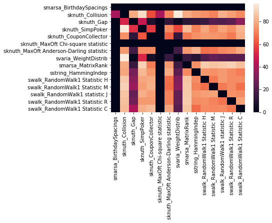

# SmallCrush-independence
- Large dataset of 6200 result logs obtained from application of SmallCrush battery from TestU01 Randomness Test Suite on the [62 RNGs](https://www.gnu.org/software/gsl/doc/html/rng.html) defined in [GSL v2.6](https://www.gnu.org/software/gsl/), each seeded with 100 different seeds.
- Correlation and Independence study of the 15 tests of randomness defined in the SmallCrush battery. See [1].

## Dependencies
- os
- seaborn

## The Dataset
The directory structure is as follows:

The smallcrush directory contains 100 sub-directories named after the seed for the RNGs, and each of these sub-directories contain 62 result logs for the SmallCrush battery applied on 62 RNGs defined in GSL v2.6.

## Usage
- Python packages used in the jupyter notebook pvalue.ipynb are **os, numpy, scipy, pandas and seaborn**. Installing seaborn alone should cover all these as dependencies, except os.
- Please **run pvalue.ipynb** which will generate 2 sub-directories pval and pval_clean as well as a CSV file **corr.csv** that contains the final results. At the end of the ipython notebook, a heat map plot is also generated to visualize the correlations between the tests (**darker = higher correlation**).

## Important Note
Ideally, this matrix should be perfectly symmetric. However, it is approximately symmetric. This is most likely due to the binning method being different for the first sub-interval of the k(=10) sub-intervals. As seen in **step1.4 of Algorithm CT_Single**[1], first interval is closed while the other k-1 intervals are only half-closed. However, for our purposes it is a good enough approximation as the heat-map is almost symmetric.

## Conclusions
- The paper states that they chose "some well-known good pseudorandom number generators such as **G-DES, G-BBS, G-ANSI and G-SHA-1**" in their experiments. And the correlation matrix shown in the paper is only for **G-BBS** as an example.
- Using all the 62 RNGs from GSL, our correlation matrix doesn't look that promising as our values are all over the place. On the other hand, they obtained far more *binary* results - either close to 100 or to 0.
- So I plotted 2 other heatmaps as follows:
    1. Using [15 simulation level RNGs](https://www.gnu.org/software/gsl/doc/html/rng.html#random-number-generator-algorithms)
    2. Using [rest of the RNGs](https://www.gnu.org/software/gsl/doc/html/rng.html#other-random-number-generators) (Note that most of the generators in this section are based on single linear congruence relations)
- As you can see in the heatmaps attached below, using the good quality RNGs yields clear results; that 
> **smarsa_BirthdaySpacings** is highly correlated to **sknuth_MaxOft Chi-square statistic**. 
- Since **sknuth_MaxOft Chi-square statistic** is calculated as part of **sknuth_MaxOft test** which also calculates another statistic **sknuth_MaxOft Anderson-Darling statistic**, we can say that
> **smarsa_BirthdaySpacings** test can be skipped.
- Note that this particular correlation also holds for rest of the RNGs.

## Using all 62 RNGs

## Using 15 Simulation Level RNGs

## Using rest of the RNGs

## References:
1. Fan, Limin, Hua Chen, and Si Gao. "A general method to evaluate the correlation of randomness tests." International Workshop on Information Security Applications. Springer, Cham, 2013.

